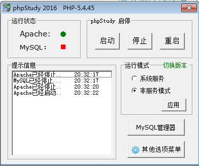

# php 第一章
##01. 服务器环境配置与开发工具配置
###安装Apachar
最终目标如下图...

```php
安装以下软件：
httpd-2.4.37-o102p-x64-vc14(1).zip
//合并文件(夹)
mod_fcgid-2.3.9a-2.4.x-x64-vc14.zip
mod_fcgid-2.3.9a-2.4.x-x86-vc14.zip
//合并文件(夹)
php-5.6.37-nts-Win32-VC11-x64.zip
php-5.6.38-Win32-VC11-x64.zip
```
保存为phpserver与PHPStudy两个文件夹
并配置文件：
1.找到D:\phpserver\Apache24\conf\httpd.conf(找到httpd.conf文件)
将38行改为  Define SRVROOT "D:/phpserver/Apache24" (找到conf文件夹)
2.在httpd.conf中最后面放入：
```php
PHPIniDir "D:\phpserver"
LoadModule php5_module "D:\phpserver\php5apache2_4.dll"
<IfModule php5_module>
AddType application/x-httpd-php .php
AddType application/x-httpd-php .php3
AddType application/x-httpd-php .php5
</IfModule>
```